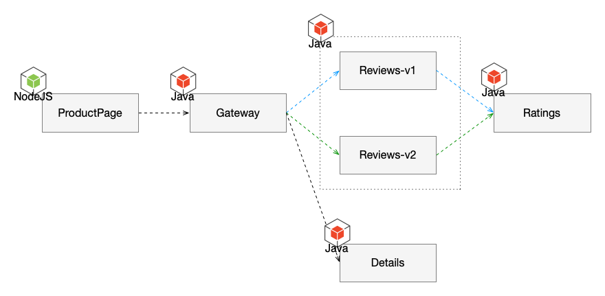
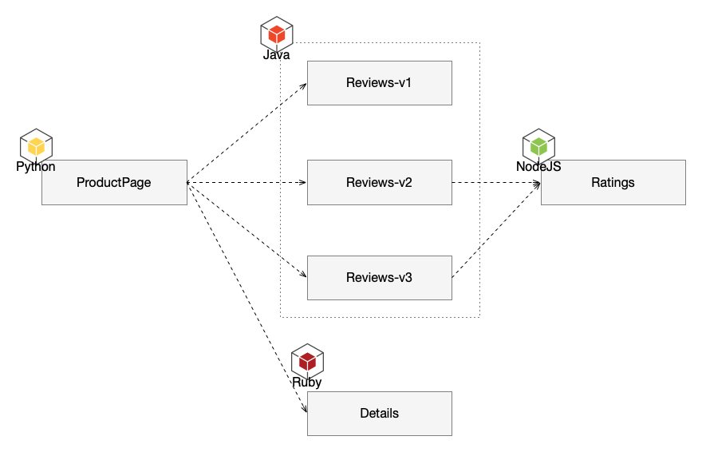

Table of Content:
* [1. Setup](#1-setup)
  * [1.1. Setup Clickhouse](#11-setup-clickhouse)
  * [1.2. Configure](#12-configure)
  * [1.3. Prepare manifest](#13-prepare-manifest)
  * [1.4. Setup pipy repo](#14-setup-pipy-repo)
  * [1.5. Deploy springboot apps](#15-deploy-springboot-apps)
  * [1.6. Deploy bookinfo apps](#16-deploy-bookinfo-apps)
  * [1.7. Deploy dubbo apps](#17-deploy-dubbo-apps)
* [2. Demo Application Introduction](#2-demo-application-introduction)
* [3. Springboot/Bookinfo Operating](#3-springbootbookinfo-operating)
  * [3.1. Canary](#31-canary)
    * [3.1.1. SpringBoot](#311-springboot)
    * [3.1.2. Bookinfo](#312-bookinfo)
  * [3.2. Rate Limit](#32-rate-limit)
    * [3.2.1 SpringBoot](#321-springboot)
    * [3.2.2 Bookinfo](#322-bookinfo)
  * [3.3. Circuit breaker](#33-circuit-breaker)
    * [3.3.1 SpringBoot](#331-springboot)
    * [3.3.2 Bookinfo](#332-bookinfo)
  * [3.4. Black/White List & ACL](#34-blackwhite-list--acl)
    * [3.4.1 SpringBoot](#341-springboot)
    * [3.4.2 Bookinfo](#342-bookinfo)
* [4. Dubbo Operating](#4-dubbo-operating)
  * [4.1. Rate Limit](#41-rate-limit)
  * [4.2. Cricuit Breaker](#42-cricuit-breaker)
  * [4.3. Black/White List & ACL](#43-blackwhite-list--acl)
* [5. Observability](#5-observability)
  * [5.1. Logging](#51-logging)
  * [5.2. Tracing](#52-tracing)
  * [5.3. Metrics](#53-metrics)
* [6. FAQ](#6-faq)
  * [6.1. How to access Pipy Repo?](#61-how-to-access-pipy-repo)

## 1. Setup

### 1.1. Setup Clickhouse

Execute `docker-compose -f clickhouse.yaml up -d` to run a clickhouse server.

```yaml
#clickhouse.yaml
version: "3"
services:
  server:
    container_name: clickhouse-server
    image: yandex/clickhouse-server:21.8.10
    user: clickhouse
    ports:
      - "8123:8123"
      - "9000:9000"
      - "9009:9009"
    ulimits:
      nproc: 65535
      nofile:
        soft: 262144
        hard: 262144

```

### 1.2. Configure

Update clickhouse address in [logger.json](scripts/springboot/config/logger.json).

### 1.3. Prepare manifest

Do kustomize build. Skip this if nothing change. First of all, make sure the `jq` cli installed.

```shell
kustomize build --load-restrictor LoadRestrictionsNone config/repo -o artifacts/pipy-repo.yaml
kustomize build --load-restrictor LoadRestrictionsNone config/springboot -o artifacts/springboot.yaml
kustomize build --load-restrictor LoadRestrictionsNone config/bookinfo -o artifacts/bookinfo.yaml
kustomize build --load-restrictor LoadRestrictionsNone config/dubbo -o artifacts/dubbo.yaml
```
### 1.4. Setup pipy repo

```shell
kubectl apply -f artifacts/pipy-repo.yaml
```

Make sure pipy-repo pod is up:

```shell
kubectl get po -n pipy
NAME                         READY   STATUS    RESTARTS   AGE
pipy-repo-85b756c885-zv5c9   1/1     Running   0          20s
```

**Init springboot codebase:**

```shell
pushd scripts/springboot
./init-repo.sh
popd
```

**Init bookinfo codebase:**

```shell
pushd scripts/bookinfo
./init-repo.sh
popd
```

**Init dubbo codebase**

```shell
pushd scripts/dubbo
./init-repo.sh
popd
```

### 1.5. Deploy springboot apps

```shell
kubectl apply -f artifacts/springboot.yaml
```

### 1.6. Deploy bookinfo apps

```shell
kubectl apply -f artifacts/bookinfo.yaml
```

### 1.7. Deploy dubbo apps

```shell
kubectl apply -f artifacts/dubbo.yaml
```

## 2. Demo Application Introduction

**SpringBoot Bookinfo**



**Istio Bookinfo**



**Dubbo**


## 3. Springboot/Bookinfo Operating

### 3.1. Canary

Currently, match supports `header`, `method` and `path`. All of them supports regular expression. 

#### 3.1.1. SpringBoot

* Firefox: show rating
* Others: no rating

Config: [router.json](scripts/springboot/config/router.json)

#### 3.1.2. Bookinfo

* Firefox: show blacking rating
* Chrome: show red rating
* Others: no rating

Config: [router.json](scripts/bookinfo/config/router.json)

### 3.2. Rate Limit

Implemented in service provider side.

#### 3.2.1 SpringBoot

* SpringBoot Config: [throttle.json](scripts/springboot/config/inbound/throttle.json)

Sample: 

```json
{
  "services": {
    "samples-bookinfo-review": {
      "rateLimit": 10
    }
  }
}
```

Access review service via gateway and we use *wrk* to simulate requests, `wrk -c5 -t5 -d10s --latency http://localhost:30010/bookinfo-reviews/reviews/2099a055-1e21-46ef-825e-9e0de93554ea`.

#### 3.2.2 Bookinfo

* Bookinfo Config: [throttle.json](scripts/bookinfo/config/inbound/throttle.json)

```json
{
  "services": {
    "productpage": {
      "rateLimit": 30
    }
  }
}
```

After change rate limit of product page to `30`, let's generate load with wrk by executing command `wrk -c100 -t1 -d10 http://localhost:30088/productpage?u=normal`. Now you will get the RPS round 30.

### 3.3. Circuit breaker

Implemented in service provider side.

#### 3.3.1 SpringBoot

* SpringBoot Config: [circuit-breaker.json](scripts/springboot/config/inbound/circuit-breaker.json)


```json
{
  "services": {
    "samples-bookinfo-details": {
      "enabled": false
    }
  },
  "response": {
    "head": {
      "status": 503
    },
    "message": "service unavailable!"
  }
}
```

Update `enabled` to `false` and execute `curl -is http://localhost:30010/bookinfo-details/details/2099a055-1e21-46ef-825e-9e0de93554ea`. You will get 503 response.

#### 3.3.2 Bookinfo

* Bookinfo Config: [circuit-breaker.json](scripts/springboot/config/inbound/circuit-breaker.json)

```json
{
  "services": {
    "productpage": {
      "enabled": true
    }
  },
  "response": {
    "head": {
      "status": 503
    },
    "message": "service unavailable!"
  }
}
```

Now we can enable the circuit breaker by set `enabled` to `true`. Then you will get *service unavailable!* on page after page refreshed.

### 3.4. Black/White List & ACL

Implemented in service provider side.

#### 3.4.1 SpringBoot

* SpringBoot Config: [ban.json](scripts/springboot/config/inbound/ban.json)

```json
{
  "services": {
    "samples-bookinfo-ratings": {
      "white": [],
      "black": [
        "samples-api-gateway"
      ]
    }
  }
}
```

With config above, you should get 403 forbidden response if attempting to execute `curl -i http://localhost:30010/bookinfo-ratings/ratings/2099a055-1e21-46ef-825e-9e0de93554ea`.

Once remove `samples-api-gateway` from blacklist, will get 200 response with correct rating data.

#### 3.4.2 Bookinfo

* Bookinfo Config: [ban.json](scripts/bookinfo/config/inbound/ban.json)

```json
{
  "services": {
    "reviews": {
      "white": [],
      "black": ["productpage"]
    }
  }
}
```

One inject *productpage* to black list of *reviews*, you will get *Sorry, product reviews are currently unavailable for this book.* on page, cause the access of *productpage* is denied by *reviews*.

## 4. Dubbo Operating

There is a HTTP endpoint exposing by *Consumer Service* which ouputing current date and time.

```shell
curl -i --location --request POST '43.129.176.183:30088/hello' --header 'Content-Type: application/json' --header 'Accept: text/plain' --data-raw '{"name": "world"}'

HTTP/1.1 200
Content-Type: text/plain;charset=UTF-8
Content-Length: 80
Date: Sun, 27 Feb 2022 13:23:42 GMT

V1-[hello-service] : Hello, world, Today is (2022-02-27), Time is (13:23:42.739)
```

### 4.1. Rate Limit

Update the config in [throttle.json](scripts/dubbo/config/inbound/throttle.json). The current setting of request rating is `10`.

We do request simulating with wrk too. Since the endpoint is one *POST* one, we need to prepare a Lua script first:

```
wrk.method = "POST"
wrk.headers["Content-Type"] = "application/json"
wrk.headers["Accept"] = "text/plain"
wrk.body = "{\"name\": \"world\"}"
```

Store above script in `post.lua` and execute command bellow:

```shell
wrk -c5 -t5 -d15s --script=/tmp/post.lua --latency http://43.129.176.183:30088/hello
Running 15s test @ http://43.129.176.183:30088/hello
  5 threads and 5 connections
  Thread Stats   Avg      Stdev     Max   +/- Stdev
    Latency   454.12ms  392.86ms   1.06s    33.04%
    Req/Sec     5.40      6.29    30.00     94.12%
  Latency Distribution
     50%  498.63ms
     75%  939.13ms
     90%  972.75ms
     99%    1.05s
  165 requests in 15.04s, 31.24KB read
Requests/sec:     10.97
Transfer/sec:      2.08KB
```

Adjust the limit rate as you hope and run the test below. **One more thing to note, keep the option of *thread* and *connection* same for wrk.**

### 4.2. Cricuit Breaker

Go into config [circuit-breaker.json](scripts/dubbo/config/circuit-breaker.json), and set value of `enable` to `true`. Now you enable the circuit breaker for service `io.flomesh.demo.dubbo.api.DemoHelloService:sayHello(Ljava/lang/String;)`. You can also find the fallback reponse there.

Now you can try to send a request:

```shell
curl -i --location --request POST '43.129.176.183:30088/hello' --header 'Content-Type: application/json' --header 'Accept: text/plain' --data-raw '{"name": "world"}'
HTTP/1.1 200
Content-Type: text/plain;charset=UTF-8
Content-Length: 80
Date: Sun, 27 Feb 2022 13:32:28 GMT

V1-[hello-service] : Hello, world, Today is (2222-02-22), Time is (22:22:22.222)
```

It does respond the fallback responce instead of current date and time.

###  4.3. Black/White List & ACL

The balck/white list feature is same as SpringBoot one. Update the list in config [ban.json](scripts/dubbo/config/inbound/ban.json).

In this demo, we just deployed `v1` version applications. So the `consumer-service-v2` in black list won't work, let update to `consumer-service-v1` and run the commad.

```shell
curl -i --location --request POST '43.129.176.183:30088/hello' --header 'Content-Type: application/json' --header 'Accept: text/plain' --data-raw '{"name": "world"}'
HTTP/1.1 500
Content-Length: 0
Date: Sun, 27 Feb 2022 13:31:33 GMT
Connection: close
```

This setting means that `Hello Servie` deny all requet from `consumer-service-v1`. And the `Consumer Service` responds with HTTP 500, and you will find exception thrown. As best practice, it's better to handle exception for Dubbo RPC. We simplify this with thrown exception directly.

## 5. Observability

### 5.1. Logging

Request and response loggged into Clickhouse.


### 5.2. Tracing

Implementing with OpenTelemetry. Logged together with req/res log, and stored in Clickhouse.

### 5.3. Metrics

Extract metrcis from Clickhouse and display via Grafana.

## 6. FAQ

### 6.1. How to access Pipy Repo?

The pipy repo deployed in cluster is exposed as node port `30060` and it's light without repo GUI. 

With anther pipy running as repo client, you can access repo via GUI:

```shell
pipy http://localhost:30060 --admin-port=6060
```

Then, open `http://localhost:6060` in browser.
